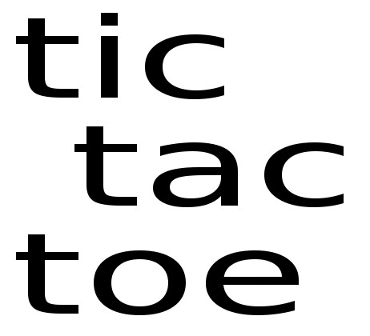

# Tic-Tac-Toe



Добро пожаловать в мою версию игры крестики-нолики, разработанную мной для программы обучения Treehouse FSJS.

Моя версия совсем немного отличается от ожидаемой. Как обычно основные отличия в верстке - я использовал полностью оригинальную верстку и стили. Для стилизации игры используются самый современные приемы CSS, такие как CSS Grid Layout.

В игру можно играть как одному против компьютера, так и в паре. Для каждого играка можно задать имя, выбрать один из четырех цветов. А так же, играя против компьютреа, игрок может выбрать себе стартовую фигуру. При настройке игры можно не выбирать ничего, в этом случае игра начнется с дефолтными настройками.

Так же игрок может выбрать размер поля - 3 на 3, 4 на 4 или 5 на 5. Подробнее о логике игры смотрите в комментариях к скриптам. Для написания скриптов я использовал ES6 и Babel. К файлу index.html подключены именно транскомпилированные версии скритов. Однако, если вы будете запускать игру в современном броузере, то можно запускать и не транскопилированные скрипты, которые находятся по пути *src/...*.

После завершения раунда в верху выведется имя победителя. Через 3 секунды после этого очистится игровое поле и начнется новый раунд.

В игре есть игровое меню. Для того чтобы его открыть нужно потянуть за маркер в левой части экрана (или в верхней части, если экран маленький). Через меню вы можете очистить игровую статистику и начать с первого раунда и со счетом 0-0.

## Приятной игры!

To run the project  one can start index.html file in its browser
or 
use the following commands:
```shell
    npm install
    npm start
```

### I hope you will enjoy it. Max Eremin
